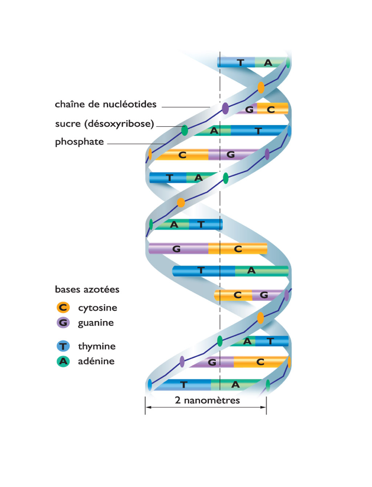
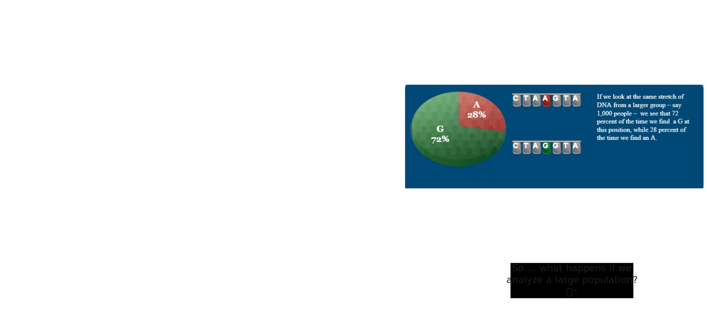
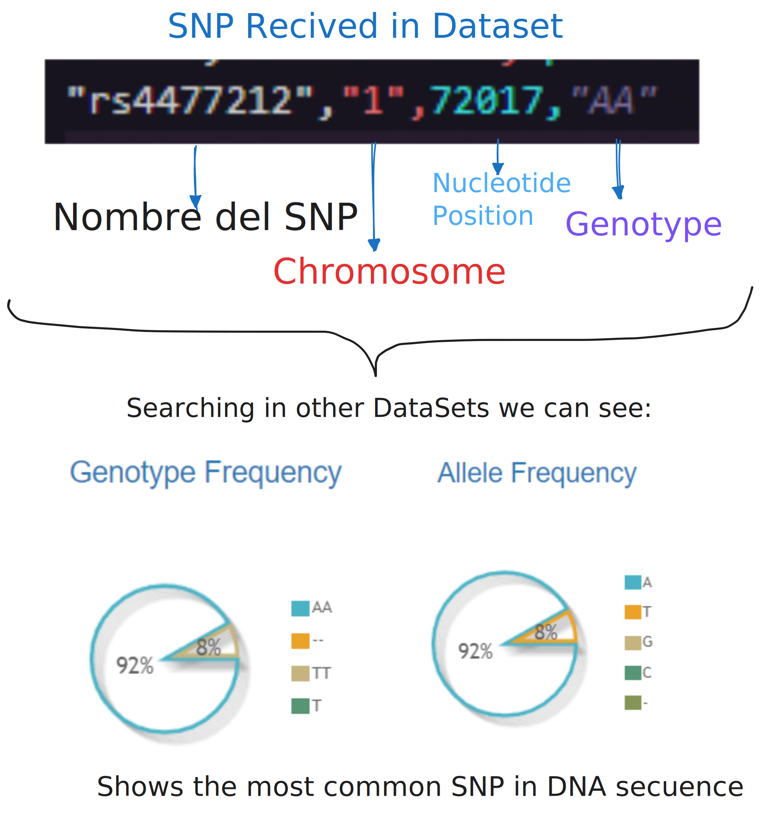

# Procesamiento de una Cadena de ADN mediante Redes Neuronales: Predicción de Enfermedades a través de SNPs

## Introducción

El análisis de SNPs (polimorfismos de nucleótido único) en el ADN nos permite comprender cómo variaciones genéticas pueden influir en la predisposición a ciertas enfermedades. Las redes neuronales son herramientas poderosas que pueden aprender a partir de estas variaciones para predecir fenotipos, como la presencia o ausencia de enfermedades. En esta exposición, desglosaremos el procesamiento de una cadena de ADN a través de un modelo de red neuronal

## Estructura del ADN:
<div align="center">
  
</div>

## Entendiendo los [SNPs](https://learn.genetics.utah.edu/content/precision/snips/)


## 1. Capa de Entrada

Comprendiendo ahora la estructura del ADN, y cuando se identifica un SNP, vamos a ver los puntos clave de la capa de entrada de nuestro modelo de red neuronal:

- **[Cromosoma](https://www.chromosomewalk.ch/en/list-of-chromosomes/) (numérico)**: Representa el cromosoma donde se encuentra el SNP.
- **Posición**: Indica la ubicación exacta del SNP en el cromosoma.
- **Genotipo**: Este es el tipo de alelo presente en la posición específica. Utilizamos codificación one-hot para representar los genotipo

Así, un vector de entrada para un SNP específico podría verse así:

```
[1, 72017, 1, 0, 0]
```

<div align="center">
  
</div>

## 2. Capas Ocultas

Las capas ocultas son donde ocurre la mayor parte del procesamiento en la red neuronal. En este modelo, empleamos:

- **Capas Densas con activación ReLU**: Cada capa densa aplica transformaciones lineales a la entrada y luego utiliza la función de activación ReLU (Rectified Linear Unit).
- **Conexiones Residuales**: Estas conexiones permiten que la información de la capa anterior se incorpore directamente a la siguiente.

## 3. Capa de Salida

La capa de salida produce la predicción final del modelo. Dependiendo del tipo de tarea, se elige la función de activación adecuada:

- **Clasificación binaria**: Para problemas que implican una predicción de sí/no.
- **Clasificación multiclase**: Para predecir entre varias categorías.

## 4. Técnicas Clave

Para asegurar que el modelo sea robusto y generalice bien, implementamos varias técnicas clave:

- **Regularización**: Utilizamos técnicas como la regularización L2 y el dropout.
- **Optimización**: Empleamos el optimizador Adam, que ajusta los pesos de la red de manera eficiente.

## 5. Predicción de Fenotipos

El modelo se basa en los principios de la herencia mendeliana y las técnicas de aprendizaje automático para inferir fenotipos a partir del genotipo.

## Resumen

En resumen, el proceso de transformación de información genética en predicciones fenotípicas a través de redes neuronales implica:

1. **Codificación de datos genéticos**.
2. **Aplicación de transformaciones no lineales**.
3. **Uso de técnicas de regularización y optimización**.

## Ejemplo de Predicción de Fenotipos a partir de SNPs

En esta sección se describe el análisis genómico con los datos obtenidos.

### Datos de Entrada

Los datos utilizados en este análisis genómico contienen un total de **966,977 SNPs** distribuidos en **22 cromosomas únicos** y **20 genotipos únicos**. A continuación, un resumen de la estadística por cromosoma:

| Cromosoma | Número de SNPs | Posición mínima | Posición máxima | Posición media |
|-----------|----------------|-----------------|-----------------|----------------|
| 1         | 77,230         | 72,017          | 247,185,615      | 124,063,000    |
| 2         | 77,691         | 8,674           | 242,697,433      | 117,604,200    |
| 3         | 63,523         | 36,495          | 199,322,659      | 93,250,840     |
| ...       | ...            | ...             | ...              | ...            |

### Distribución de Genotipos

El conjunto de datos contiene la siguiente distribución de genotipos:

- **CC**: 174,242
- **GG**: 173,508
- **TT**: 147,357
- **AA**: 147,284
- **CT**: 115,917
- **AG**: 115,604
- Otros: Menos representados

### Transformación a Vectores de Entrada

Para el análisis, transformamos cada SNP en un vector numérico que nuestro modelo puede procesar. Un ejemplo de los SNPs transformados sería:

- **SNP1**: `Cromosoma = 1`, `Posición = 72,017`, `Genotipo = CC`  
  **Vector**: `[1, 72017, 1, 0, 0]`

- **SNP2**: `Cromosoma = 2`, `Posición = 8,674`, `Genotipo = GG`  
  **Vector**: `[2, 8674, 0, 0, 1]`

### Proceso a través del Modelo

1. **Capa de Entrada**: Los vectores de entrada se alimentan al modelo de red neuronal.
2. **Capas Ocultas**: El modelo aplica capas densas con activación ReLU y conexiones residuales.
3. **Capa de Salida**: En este análisis, utilizamos una salida para predicciones de clasificación binaria (sí/no).

### Análisis Clustering con KMeans

Durante el análisis, se determinó que el número óptimo de clusters (K) es **3**, con los siguientes resultados:

| Cluster | Magnitud media | Cromosomas únicos (media) | Número de SNPs |
|---------|----------------|--------------------------|----------------|
| 0       | 0.32           | 10                       | 587,812        |
| 1       | 0.32           | 13                       | 346,666        |
| 2       | 2.01           | 22                       | 192            |

El gráfico del **Elbow Plot** fue guardado en: `./processed_data/elbow_plot_20241002_223223.png`.

### Interpretación del Output

Con base en los resultados del clustering, podemos interpretar que el **Cluster 2** contiene SNPs con una magnitud más alta, lo que podría indicar una mayor relevancia genética en la predisposición a enfermedades.