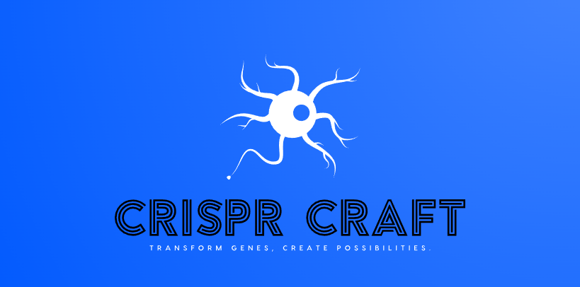

# Proyecto de Biotecnología para la Feria Tecnológica

Crearemos una red neuronal perceptrón multicapa (MLP) con conexiones residuales para predecir fenotipos a partir de datos genotípicos. El modelo incorporará el mapeo genotipo-fenotipo, utilizando características de entrada como los polimorfismos de nucleótido único (SNP) y las posiciones de los cromosomas para inferir rasgos fenotípicos, incorporaremos estadísticas de resumen (si están disponibles) y nos centraremos en las leyes mendelianas de la herencia para predecir fenotipos simples.

## Conjunto de datos propuesto: genome.csv
Estructura:
- rsid: Identificador del SNP.
- cromosoma: Número de cromosoma.
- posición: Posición física del SNP en el cromosoma.
- genotipo: Información del alelo (por ejemplo, AA, AG, GG).
#### Modificaciones:
- Puede añadir etiquetas fenotípicas (por ejemplo, color de ojos, altura, susceptibilidad a enfermedades) para el aprendizaje supervisado.

## Arquitectura del Modelo

### Capa de Entrada:
- **Cromosoma (numérico)**: Valores enteros que representan los cromosomas (1-22, X=23, Y=24).
- **Posición**: Ubicación física en el cromosoma.
- **Genotipo**: Codificado como vectores one-hot (por ejemplo, AA = [1, 0, 0], AG = [0, 1, 0], GG = [0, 0, 1]).

### Capas Ocultas:
- **Capas Densas con activación ReLU**: Para capturar relaciones no lineales entre SNPs y fenotipo.
- **Conexiones Residuales**: Para combinar efectos lineales de los genotipos e interacciones no lineales, similar a la arquitectura descrita en el artículo.

### Capa de Salida:
- **Para clasificación binaria** (por ejemplo, presencia/ausencia de enfermedad), usar una función de activación sigmoide.
- **Para clasificación multiclase** (por ejemplo, color de ojos), usar una función de activación softmax.

## Técnicas clave 
- **Regularización**: Regularización L2 y dropout para evitar el sobreajuste. 
- **Optimización**: Optimizador Adam con ajuste de la tasa de aprendizaje. 
- **Predicción de fenotipos**: Aprovecha los principios de la herencia mendeliana y las técnicas de aprendizaje automático para inferir el fenotipo a partir del genotipo.

### Colores

